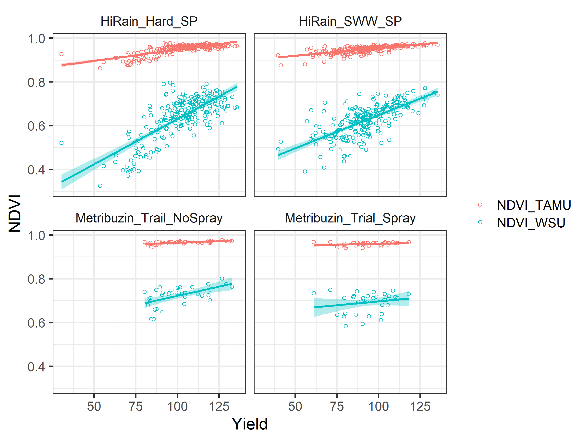

Zubrod quick analysis
================
Riley M. Anderson
March 26, 2025

  

- [Overview](#overview)
  - [Summary of Results](#summary-of-results)
- [Correlation between TAMU & WSU NDVI
  platforms](#correlation-between-tamu--wsu-ndvi-platforms)
- [Checking the interaction (slopes) on NDVI and Yield for different
  platforms](#checking-the-interaction-slopes-on-ndvi-and-yield-for-different-platforms)
- [Models and likelihood ratio test](#models-and-likelihood-ratio-test)
- [NDRE](#ndre)
  - [Correlation between TAMU & WSU NDRE
    platforms](#correlation-between-tamu--wsu-ndre-platforms)
  - [Checking the interaction (slopes) on NDRE and Yield for different
    platforms](#checking-the-interaction-slopes-on-ndre-and-yield-for-different-platforms)
  - [Models and likelihood ratio test
    (NDRE)](#models-and-likelihood-ratio-test-ndre)
- [Walla Walla](#walla-walla)
  - [Session Information](#session-information)

## Overview

What is this analysis about?

### Summary of Results

- 

## Correlation between TAMU & WSU NDVI platforms

<!-- -->

- **A)** = HiRain_Hard_SP

- **B)** = HiRain_SWW_SP

- **C)** = Metribuzin_Trail_NoSpray

- **D)** = Metribuzin_Trial_Spray

## Checking the interaction (slopes) on NDVI and Yield for different platforms

<!-- -->

## Models and likelihood ratio test

    ## 
    ## Call:
    ## lm(formula = Yield ~ NDVI_WSU * NDVI_TAMU, data = d)
    ## 
    ## Residuals:
    ##     Min      1Q  Median      3Q     Max 
    ## -50.087  -7.451   0.210   7.848  32.516 
    ## 
    ## Coefficients:
    ##                    Estimate Std. Error t value Pr(>|t|)    
    ## (Intercept)           245.0      127.5   1.921   0.0552 .  
    ## NDVI_WSU            -1649.4      278.8  -5.917 5.73e-09 ***
    ## NDVI_TAMU            -133.7      136.7  -0.978   0.3283    
    ## NDVI_WSU:NDVI_TAMU   1696.5      280.4   6.050 2.66e-09 ***
    ## ---
    ## Signif. codes:  0 '***' 0.001 '**' 0.01 '*' 0.05 '.' 0.1 ' ' 1
    ## 
    ## Residual standard error: 12.14 on 557 degrees of freedom
    ## Multiple R-squared:  0.5019, Adjusted R-squared:  0.4992 
    ## F-statistic: 187.1 on 3 and 557 DF,  p-value: < 2.2e-16
    ## Anova Table (Type II tests)
    ## 
    ## Response: Yield
    ##                    Sum Sq  Df F value    Pr(>F)    
    ## NDVI_WSU              367   1  2.4904    0.1151    
    ## NDVI_TAMU            4161   1 28.2144 1.572e-07 ***
    ## NDVI_WSU:NDVI_TAMU   5398   1 36.5986 2.665e-09 ***
    ## Residuals           82149 557                      
    ## ---
    ## Signif. codes:  0 '***' 0.001 '**' 0.01 '*' 0.05 '.' 0.1 ' ' 1

- Texas A&M NDVI is a much tighter predictor of Yield.

# NDRE

## Correlation between TAMU & WSU NDRE platforms

<!-- -->

## Checking the interaction (slopes) on NDRE and Yield for different platforms

<!-- -->

## Models and likelihood ratio test (NDRE)

    ## 
    ## Call:
    ## lm(formula = Yield ~ NDRE_WSU + NDRE_TAMU, data = s_ndre)
    ## 
    ## Residuals:
    ##     Min      1Q  Median      3Q     Max 
    ## -55.388  -7.000  -0.131   7.270  29.613 
    ## 
    ## Coefficients:
    ##             Estimate Std. Error t value Pr(>|t|)    
    ## (Intercept)   128.70      13.45   9.568  < 2e-16 ***
    ## NDRE_WSU     -260.90      50.56  -5.160 3.44e-07 ***
    ## NDRE_TAMU     362.96      34.09  10.648  < 2e-16 ***
    ## ---
    ## Signif. codes:  0 '***' 0.001 '**' 0.01 '*' 0.05 '.' 0.1 ' ' 1
    ## 
    ## Residual standard error: 11.57 on 558 degrees of freedom
    ## Multiple R-squared:  0.5475, Adjusted R-squared:  0.5459 
    ## F-statistic: 337.6 on 2 and 558 DF,  p-value: < 2.2e-16
    ## Anova Table (Type II tests)
    ## 
    ## Response: Yield
    ##           Sum Sq  Df F value    Pr(>F)    
    ## NDRE_WSU    3562   1  26.627 3.436e-07 ***
    ## NDRE_TAMU  15170   1 113.388 < 2.2e-16 ***
    ## Residuals  74654 558                      
    ## ---
    ## Signif. codes:  0 '***' 0.001 '**' 0.01 '*' 0.05 '.' 0.1 ' ' 1

- Texas A&M NDRE is a slightly better predictor of Yield. Both are very
  good.

# Walla Walla

<!-- -->

<!-- -->

## Session Information

    R version 4.2.3 (2023-03-15 ucrt)
    Platform: x86_64-w64-mingw32/x64 (64-bit)
    Running under: Windows 10 x64 (build 19045)

    Matrix products: default

    locale:
    [1] LC_COLLATE=English_United States.utf8 
    [2] LC_CTYPE=English_United States.utf8   
    [3] LC_MONETARY=English_United States.utf8
    [4] LC_NUMERIC=C                          
    [5] LC_TIME=English_United States.utf8    

    attached base packages:
    [1] stats     graphics  grDevices utils     datasets  methods   base     

    other attached packages:
     [1] car_3.1-2       carData_3.0-5   cowplot_1.1.3   lubridate_1.9.3
     [5] forcats_1.0.0   stringr_1.5.1   dplyr_1.1.4     purrr_1.0.2    
     [9] readr_2.1.5     tidyr_1.3.1     tibble_3.2.1    ggplot2_3.5.1  
    [13] tidyverse_2.0.0

    loaded via a namespace (and not attached):
     [1] highr_0.11        pillar_1.9.0      compiler_4.2.3    tools_4.2.3      
     [5] digest_0.6.35     lattice_0.20-45   nlme_3.1-162      timechange_0.3.0 
     [9] evaluate_0.24.0   lifecycle_1.0.4   gtable_0.3.5      mgcv_1.8-42      
    [13] pkgconfig_2.0.3   rlang_1.1.4       Matrix_1.5-3      cli_3.6.2        
    [17] rstudioapi_0.16.0 yaml_2.3.8        xfun_0.44         fastmap_1.2.0    
    [21] withr_3.0.0       knitr_1.47        generics_0.1.3    vctrs_0.6.5      
    [25] hms_1.1.3         rprojroot_2.0.4   grid_4.2.3        tidyselect_1.2.1 
    [29] glue_1.7.0        R6_2.5.1          fansi_1.0.6       rmarkdown_2.27   
    [33] farver_2.1.2      tzdb_0.4.0        magrittr_2.0.3    splines_4.2.3    
    [37] codetools_0.2-19  scales_1.3.0      htmltools_0.5.8.1 abind_1.4-5      
    [41] colorspace_2.1-0  labeling_0.4.3    utf8_1.2.4        stringi_1.8.4    
    [45] munsell_0.5.1    
